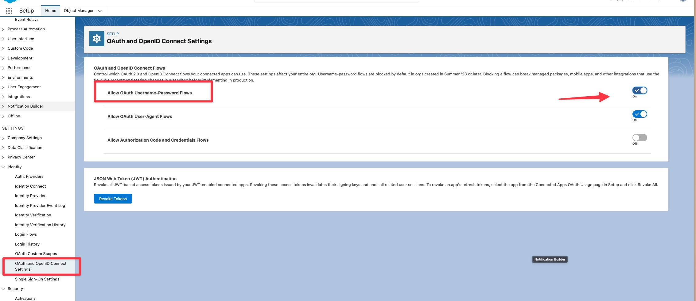

# Fully Managed Salesforce SObject Sink connector


## Objective

Quickly test [Salesforce SObject Sink](https://docs.confluent.io/cloud/current/connectors/cc-salesforce-SObjects-sink.html) connector.

## Prerequisites

All you have to do is to be already logged in with [confluent CLI](https://docs.confluent.io/confluent-cli/current/overview.html#confluent-cli-overview).

By default, a new Confluent Cloud environment with a Cluster will be created.

You can configure the cluster by setting environment variables:

* `CLUSTER_CLOUD`: The Cloud provider (possible values: `aws`, `gcp` and `azure`, default `aws`)
* `CLUSTER_REGION`: The Cloud region (use `confluent kafka region list` to get the list, default `eu-west-2` for aws, `westeurope`for azure and `europe-west2` for gcp)
* `CLUSTER_TYPE`: The type of cluster (possible values: `basic`, `standard` and `dedicated`, default `basic`)
* `ENVIRONMENT` (optional): The environment id where want your new cluster (example: `txxxxx`) 

In case you want to use your own existing cluster, you need to setup these environment variables:

* `ENVIRONMENT`: The environment id where your cluster is located (example: `txxxxx`) 
* `CLUSTER_NAME`: The cluster name
* `CLUSTER_CLOUD`: The Cloud provider (possible values: `aws`, `gcp` and `azure`)
* `CLUSTER_REGION`: The Cloud region (example `us-east-2`)
* `CLUSTER_CREDS`: The Kafka api key and secret to use, it should be separated with colon (example: `<API_KEY>:<API_KEY_SECRET>`)
* `SCHEMA_REGISTRY_CREDS` (optional, if not set, new one will be created): The Schema Registry api key and secret to use, it should be separated with colon (example: `<SR_API_KEY>:<SR_API_KEY_SECRET>`)

## Register a test account

Go to [Salesforce developer portal](https://developer.salesforce.com/signup/) and register an account.

## Register another test account

Go to [Salesforce developer portal](https://developer.salesforce.com/signup/) and register an account.

## Salesforce Account

### Create a new Connected App

Full details available [here](https://docs.confluent.io/current/connect/kafka-connect-salesforce/pushtopics/salesforce_pushtopic_source_connector_quickstart.html#salesforce-account)

Steps are:

* Select the gear icon in the upper right hand corner and choose Setup.

* Enter App in the Quick Find search box, and choose *App Manager* in the filtered results.

* Click the *New Connected App* button in the upper right corner of the Setup panel.


* Supply a Connected App Name, API Name, and Contact Email.

* Select *Enable OAuth Settings* checkbox and select the *Enable for Device Flow* checkbox. These selections enable the connector to use the Salesforce API.
* Under the *Select OAuth Scopes* field, select all of the items under Available OAuth scopes and add them to the *Selected OAuth Scopes*.

Example:


* Save the new app and press Continue at the prompt.
* Look for the Consumer Key and Consumer Secret in the displayed form. Save these so you can put them in the configuration properties file for the Salesforce connect worker.

**IMPORTANT !!**: for new orgs, "Username-Password Flow" is disabled by default, see the [help page](https://help.salesforce.com/s/articleView?id=release-notes.rn_security_username-password_flow_blocked_by_default.htm&release=244&type=5).

You need to activate this (otherwise you get `{"error":"invalid_grant","error_description":"authentication failure"}`):



### Find your Security token

Find your Security Token (emailed to you from Salesforce.com). If you need to reset your token or view your profile on Salesforce.com, select `Settings->My Personal Information->Reset My Security Token` and follow the instructions.


## Create CustomId External ID

Follow instructions [here](https://docs.confluent.io/current/connect/kafka-connect-salesforce/sobjects_sink/index.html#external-id), **for both accounts**.


## How to run

Simply run:

```
$ playground run -f fully-managed-salesforce-sobject-sink<use tab key to activate fzf completion (see https://kafka-docker-playground.io/#/cli?id=%e2%9a%a1-setup-completion), otherwise use full path, or correct relative path> <SALESFORCE_USERNAME> <SALESFORCE_PASSWORD> <SALESFORCE_CONSUMER_KEY> <SALESFORCE_CONSUMER_PASSWORD> <SALESFORCE_SECURITY_TOKEN> <SALESFORCE_USERNAME_ACCOUNT2> <SALESFORCE_PASSWORD_ACCOUNT2> <SALESFORCE_SECURITY_TOKEN_ACCOUNT2> <SALESFORCE_CONSUMER_KEY_ACCOUNT2> <SALESFORCE_CONSUMER_PASSWORD_ACCOUNT2>
```

Note: you can also export these values as environment variable

