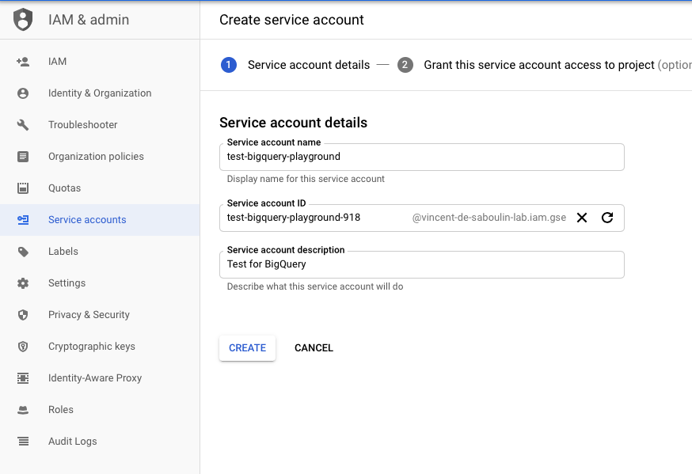
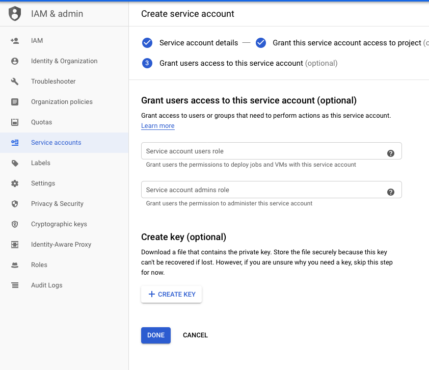

# JDBC GCP BigQuery Sink connector


## Objective

Quickly test [JDBC GCP BigQuery Source](https://docs.confluent.io/current/connect/kafka-connect-jdbc/source-connector/index.html#kconnect-long-jdbc-source-connector) connector.

Driver used is https://cloud.google.com/bigquery/docs/reference/odbc-jdbc-drivers
Docs: https://storage.googleapis.com/simba-bq-release/odbc/Simba%20Google%20BigQuery%20ODBC%20Connector%20Install%20and%20Configuration%20Guide-2.5.2.1004.pdf

* Active Google Cloud Platform (GCP) account with authorization to create resources

## GCP BigQuery Setup

* Follow [Quickstart using the web UI in the GCP Console](https://cloud.google.com/bigquery/docs/quickstarts/quickstart-web-ui) to get familiar with GCP BigQuery
* Create `Service Account` from IAM & Admin console:

Set `Service account name`:




Choose permission `BigQuery`->`BigQuery Admin`:


Create Key:



Download it as JSON:


Rename it to `keyfile.json`and place it in `./keyfile.json` or use environment variable `GCP_KEYFILE_CONTENT` with content generated with `GCP_KEYFILE_CONTENT=`cat keyfile.json | jq -aRs .`


## How to run

Simply run:

```bash
$ playground run -f jdbc-gcp-bigquery<use tab key to activate fzf completion (see https://kafka-docker-playground.io/#/cli?id=%e2%9a%a1-setup-completion), otherwise use full path, or correct relative path> <GCP_PROJECT>
```
